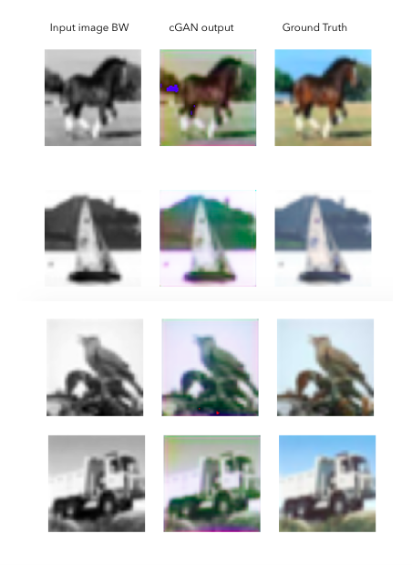

# Pix2Pix PyTorch Implementation
Using cGans converting black and white image to colored images

## After training for 10,000 on Cifar-10 Dataset

  

## Research Paper
- [Original Blog](https://phillipi.github.io/pix2pix/)
